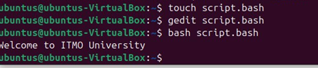
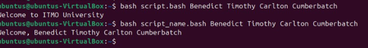


**Краткий отчет о выполнении заданий по Bash-скриптам**

**Задание 1: Создание простого скрипта**

- Создан файл script.bash
- Добавлен код:

#!/bin/bash

echo "Welcome to ITMO University"

Результат

**Задание 2: Модификация скрипта**

- Код:

#!/bin/bash

echo "Welcome, $\*"

Результат

